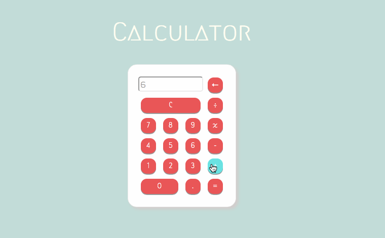

# Simple Calculator using HTML, CSS, jQuery
with the function addition (+), subtraction (-), multiplication (x), division (÷)

☞ [ENTIRE CODE](/docs/index.html)   |   
☞ [LIVE DEMO](https://hoksea.github.io/Simple-Calculator-using-jQuery/)   |   
☞ [LIVE DEMO in Codepen](https://codepen.io/hoksea/full/brdvPp) 

